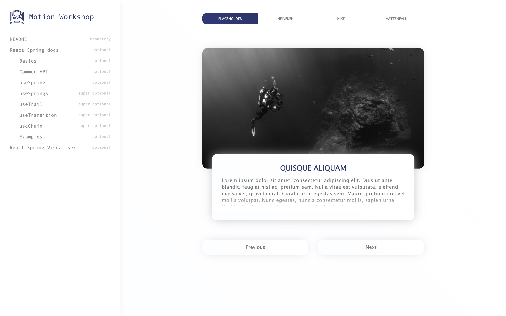

# Motion Workshop

[](https://app.netlify.com/sites/motion-workshop/deploys)



This repository holds the code for the interactive coding part of the Motion Workshop with [React Spring](https://www.react-spring.io/). Read the documentation to get the app up and running. Next to that, some things are setup for you to start animating!

Motion Workshop was bootstrapped with [Create React App](https://github.com/facebook/create-react-app). You can find the demo [here](http://motion-workshop.netlify.app/)

## Getting started

First **FORK** this repository.

In the project directory, you can run:

### `yarn start` or `yarn dev`

Runs the app in the development mode.<br />
Open [http://localhost:3000](http://localhost:3000) to view it in the browser.

The page will reload if you make edits.<br />
You will also see any lint errors in the console.

### `yarn build`

Builds the app for production to the `build` folder.<br />
It correctly bundles React in production mode and optimizes the build for the best performance.

The build is minified and the filenames include the hashes.<br />
Your app is ready to be deployed!

See the section about [deployment](https://facebook.github.io/create-react-app/docs/deployment) for more information.

## Available Utilities/Components

### `getAnimationConfiguration`

Although React Spring offers a simple API, some things might be a bit confusing. In [`src/utils/getAnimationConfiguration.js`](src/utils/getAnimationConfiguration.js) you can find a utilites that simplifies the configuration.

This utility can receive a couple of parameters:

```JS
import { config } from 'react-spring'

...

{
    from: { transform: 'translate3d(0, 0.5rem, 0)', opacity: 0 },
    to: { transform: 'translate3d(0, 0rem, 0)', opacity: 1 },
    physics: { ...config.wobbly, tension: 170 }, // basic React Spring configuration extended
    delay: 200,
    isActive: true
}
```

* **from `Object`:**  CSS properties to animate from
* **to `Object`:**  CSS properties to animate to
* **isActive `Boolean`:**  Whether to flip the animation
* **physics `Object`:**  React spring physics configuration object. Please refer to [React spring Common API documentation](https://www.react-spring.io/docs/hooks/api) for possibilities
* **delay `Number`:**  Delay in animation to account for Carousel in and out timing

### `carouselItems`

Data for the carousel is already setup for you. Please feel free to make this your own in [`src/data/carouselItems.json`](src/data/carouselItems.json)

### `Carousel`
You can find all of the code for the `Carousel` in [`src/components/Carousel/Carousel.js`](src/components/Carousel/Carousel.js). As you can see, in `CarouselItem` (located in the same file) you can configure the animations using the `getAnimationConfiguration` utility.

## Learn More

You can learn more in the [Create React App documentation](https://facebook.github.io/create-react-app/docs/getting-started).

To learn React, check out the [React documentation](https://reactjs.org/).
